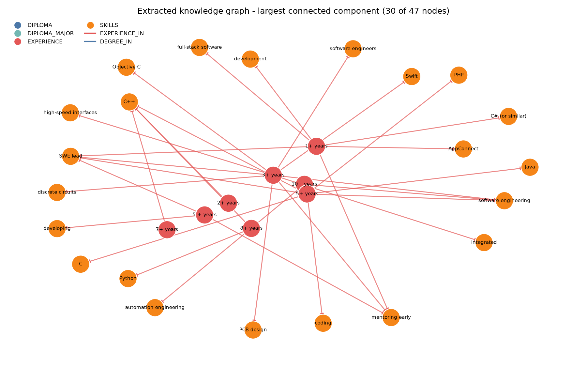
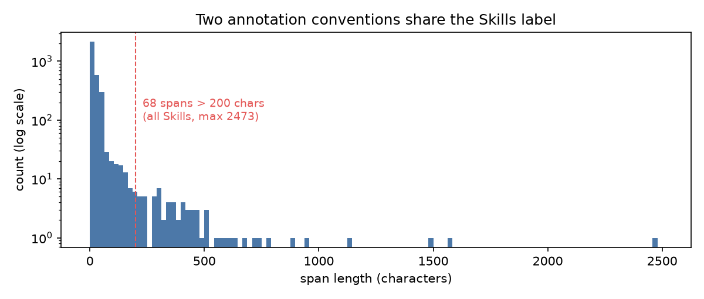

# Entity and Relation Extraction for Hiring-Domain Text

Two information-extraction tasks over hiring text, each trained, evaluated on a held-out
test set, and compared against a baseline:

| | notebook | task | corpus |
|---|---|---|---|
| **01** | [`01_entity_extraction.ipynb`](notebooks/01_entity_extraction.ipynb) | NER - pull name, skills, employers, degree, college from a resume | 200 annotated resumes |
| **02** | [`02_relation_extraction.ipynb`](notebooks/02_relation_extraction.ipynb) | relation extraction - link a qualification to its field, an amount of experience to what it is in | 86 annotated job descriptions |

Notebook 02 ends with an end-to-end chain: raw job-description text to entities to
relations to a knowledge graph.

Both notebooks are committed with their outputs, so they render in full on GitHub without
cloning anything.

---

## Headline results

### Relation extraction - the rule baseline beats the neural model

Held-out test set, 20 job descriptions, 95 gold relations. Both systems get gold entities
and both had their hyperparameters fitted on dev only.

| system | precision | recall | F1 |
|---|---|---|---|
| **rule baseline** (entity type + token distance) | 0.730 | 0.968 | **0.833** |
| trained `rel_component` (tok2vec) | 0.591 | 0.547 | 0.568 |

Per label, the baseline wins both: `DEGREE_IN` 0.977 vs 0.857, `EXPERIENCE_IN` 0.798 vs
0.463. Tuning the model's decision threshold on dev selected 0.5 - the value it already
had - so this is not a badly chosen cutoff.

**Why it wins.** The gold relations are close to deterministic given entity types:
`EXPERIENCE_IN` connects `EXPERIENCE -> SKILLS` in 299 of 301 training cases, `DEGREE_IN`
connects `DIPLOMA -> DIPLOMA_MAJOR` in 90 of 93. The heuristic is handed that structure;
the neural model has to recover it from 53 documents and 412 positives spread across 7,977
candidate pairs, and there is not enough signal to do it.

This is not evidence that neural relation extraction is a bad idea. It is evidence that on
a closed schema this small, a heuristic encoding the known structure is the right default
and a learned model has to earn its place. **The engineering point is that without the
cheap baseline, 0.57 F1 would have looked like a perfectly reasonable result.**

### End to end: raw text to knowledge graph

Sections 4-6 hand both systems gold entities, which isolates relation quality but is not
something you have at inference time. Notebook 02 therefore trains its own entity model for
this corpus (a small CPU `tok2vec` NER - 53 documents is far too little for a transformer)
and chains the two:

| label | precision | recall | F1 | support |
|---|---|---|---|---|
| EXPERIENCE | 0.969 | 0.886 | **0.925** | 35 |
| DIPLOMA_MAJOR | 0.889 | 0.696 | 0.780 | 23 |
| DIPLOMA | 0.706 | 0.800 | 0.750 | 15 |
| SKILLS | 0.474 | 0.375 | 0.419 | 72 |
| **overall** | 0.694 | 0.593 | **0.639** | 145 |

Running that chain over the whole test set yields a 47-node, 46-edge graph. The largest
connected component is below: red `EXPERIENCE` nodes (`3+ years`, `10+ years`) linked by
`EXPERIENCE_IN` to the orange `SKILLS` they qualify (`C++`, `Java`, `PCB design`, `Swift`).



### Resume NER - one number hides two different failures

Held-out test set, 30 resumes, 494 gold spans, `distilroberta-base`.

| label | precision | recall | F1 | support | relaxed recall |
|---|---|---|---|---|---|
| Name | 0.935 | 0.967 | **0.951** | 30 | 0.967 |
| Email Address | 0.561 | 0.793 | 0.657 | 29 | 0.862 |
| Degree | 0.618 | 0.583 | 0.600 | 36 | 0.667 |
| Location | 0.667 | 0.522 | 0.585 | 69 | 0.565 |
| Designation | 0.567 | 0.594 | 0.580 | 64 | 0.719 |
| College Name | 0.564 | 0.524 | 0.543 | 42 | 0.690 |
| Graduation Year | 0.467 | 0.226 | 0.304 | 31 | 0.226 |
| Companies worked at | 0.223 | 0.189 | 0.205 | 111 | 0.297 |
| Skills | 0.344 | 0.141 | 0.200 | 78 | **0.615** |
| Years of Experience | 0.000 | 0.000 | 0.000 | 4 | 0.000 |
| **overall** | 0.509 | 0.421 | **0.461** | 494 | |

An overall 0.46 invites the question of whether the model is bad or the corpus is. Splitting
every gold span into *matched exactly* / *right label, wrong boundaries* / *missed* answers
it, and the two worst labels fail for completely different reasons:

- **`Skills` is a boundary failure.** 11 spans match exactly, but 37 more are found with the
  right label and the wrong span - relaxed recall 0.615 against an exact F1 of 0.20. The
  corpus annotates whole 700-character *skills sections* alongside individual skills, so two
  annotation conventions share one label.
- **`Companies worked at` is an annotation-completeness failure.** The model finds real
  employers the corpus never labelled - it predicts `Microsoft`, `Microsoft GPS` and
  `IBM RESEARCH` on a resume whose gold lists `Microsoft GPS` twice and nothing else. Those
  correct predictions score as false positives.

`Name` - the one label with a consistent, unambiguous convention - reaches 0.95. That
contrast is the actual finding.



---

## Things worth reading the notebooks for

**Token alignment silently destroys data if you let it** (01, section 2.1). Annotation
offsets are character-level; NER trains on tokens. `char_span(alignment_mode="strict")`
discards 274 annotations and `"contract"` 99 - concentrated, not spread: `Email Address`
alone loses 53 of 229 spans, because spaCy tokenizes `indeed.com/r/Govardhana-K/` as one
token while the annotation cuts into it. `"expand"` keeps all 3,203 at the cost of widening
274 spans by a median of 8 characters. Measured, then chosen - not assumed.

**Overlap has to be resolved on tokens, not characters** (01, section 2). Once `expand`
widens spans to token boundaries, two annotations that are disjoint in characters can share
a token, and `Doc.ents` rejects that outright.

**The original tutorial's rule extractor solves a different problem** (02, section 3). It
returns free-text predicates - `'is'`, `'required'` - one per sentence. That is *open*
information extraction. This task is *closed*: given a specific entity pair, decide whether
`DEGREE_IN` or `EXPERIENCE_IN` holds. There is no scoring function under which they are
comparable, so a real baseline had to be built rather than borrowed.

**Fair comparisons need equal tuning budgets** (02, section 5.1). The baseline got two
hyperparameters fitted on dev, so the model's decision threshold is fitted on dev too.

---

## Repository layout

```
notebooks/     01_entity_extraction.ipynb, 02_relation_extraction.ipynb
configs/       spaCy training configs (base_ner.cfg, ner.cfg, rel_tok2vec.cfg)
src/           sitecustomize.py (CUDA shim) + vendored rel_component - see src/README.md
data/raw/      upstream resume corpus, downloaded at runtime, gitignored
data/processed/  DocBins
figures/       knowledge graph, span-length distribution, displaCy render
reports/       generated metrics tables
models/        trained pipelines, gitignored
```

## Running it

```bash
conda env create -f environment.yml
conda activate erx
python -m ipykernel install --user --name erx --display-name "erx"
jupyter lab
```

Run either notebook top to bottom. Both skip training if a trained model is already present
(`RETRAIN = True` forces a retrain); notebook 01 downloads its corpus on first run.

**GPU note.** Notebook 01 fine-tunes a transformer and was trained on a 4 GB RTX 2050. That
budget drove two config choices, documented in the notebook: `distilroberta-base` instead of
`roberta-base` (82M vs 125M parameters), and batcher size 500 instead of 2000, with
`accumulate_gradient = 3` preserving the effective batch. Both notebooks fall back to CPU
automatically if no GPU is present.

On Windows, CuPy cannot find a CUDA runtime by default and `spacy.require_gpu()` fails even
when `torch.cuda.is_available()` is `True` - Python 3.8+ ignores `PATH` when resolving DLL
dependencies of extension modules. [`src/sitecustomize.py`](src/sitecustomize.py) points
CuPy at the runtime already bundled in the PyTorch wheel rather than installing a second
CUDA toolkit, and the notebooks put `src/` on `PYTHONPATH` so `spacy train` subprocesses
inherit the fix.

## Data and attribution

- **Resume corpus** (notebook 01): [`laxmimerit/CV-Parsing-using-Spacy-3`](https://github.com/laxmimerit/CV-Parsing-using-Spacy-3).
  That repository ships **no LICENSE**, so it is all-rights-reserved and is **not
  redistributed here**. `data/raw/` and the DocBins built from it are gitignored; notebook 01
  downloads the corpus on first run and rebuilds them in seconds.
- **Job-description relation corpus** (notebook 02) and the vendored `rel_pipe.py` /
  `rel_model.py` / `custom_functions.py`: Explosion's
  [`rel_component`](https://github.com/explosion/projects/tree/v3/tutorials/rel_component)
  tutorial, MIT licensed. Local modifications are listed in [`src/README.md`](src/README.md).

## Limitations

Both notebooks carry a limitations section; the ones that matter most:

- **Both corpora are small.** 30 test resumes and 20 test job descriptions. Differences of a
  few points mean nothing, and `Years of Experience` has 4 gold spans in the test set - its
  0.00 means "untestable", not "learned nothing".
- **Reported NER precision is a lower bound**, because the corpus omits entities the model
  correctly finds.
- **Relation scores assume gold entities**, which isolates relation quality but flatters both
  systems relative to the full chain in section 8 - that chain inherits every entity error,
  and a missed entity silently removes every relation it would have participated in.
- **The two notebooks use different corpora and different entity schemas.** They are two
  complementary extraction tasks over hiring text, not two stages of one pipeline. Merging
  them would require a label mapping and re-annotation.
